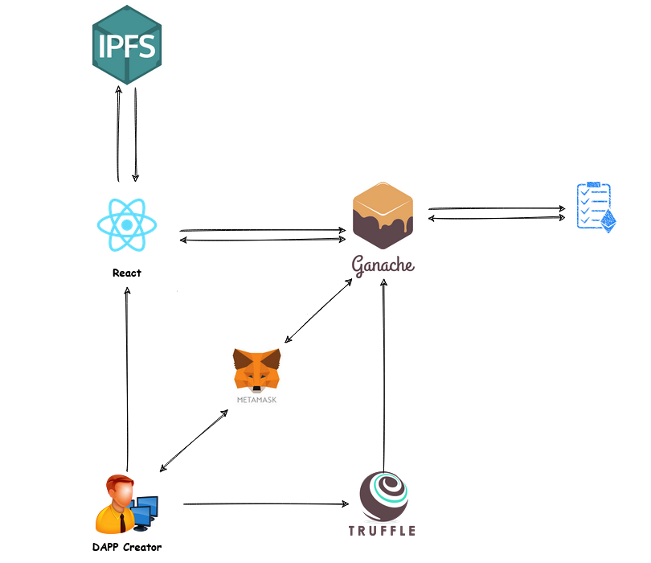
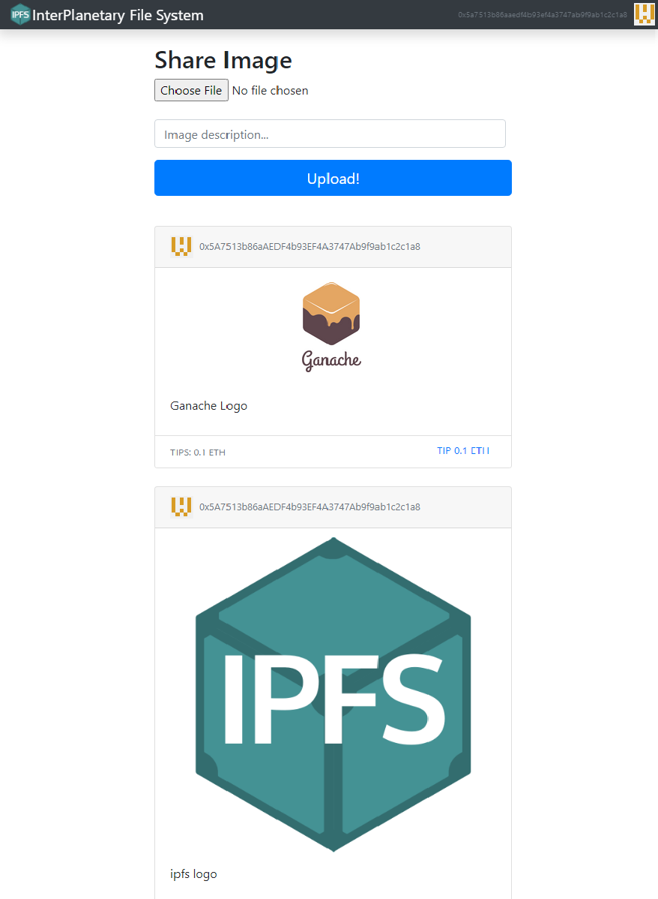

##
## IPFS Tutorial

Instructional Video: [source](https://www.youtube.com/watch?v=8rhueOcTu8k)  

***NOTE:***
Updates have been made using solidity ^8.0.0. Tutorial is not up to date on:
- Metamask web3 changes
- Solidity 8
- React 17

Major Topics:
- using IPFS to generate image Hashes
- use of identicons for addresses
- delegating tips to authors of an image
- dynamically update UI with changes to blockchain state and account changes

 ## Design

 ## UI

